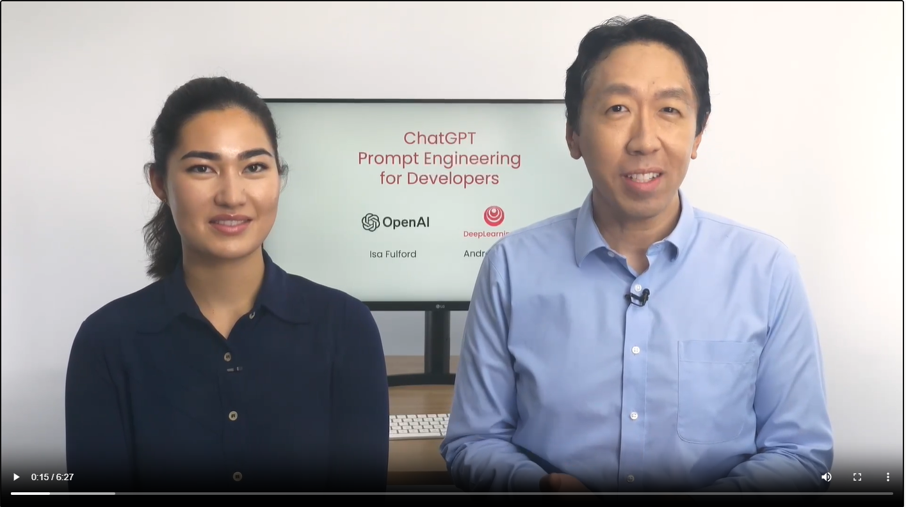
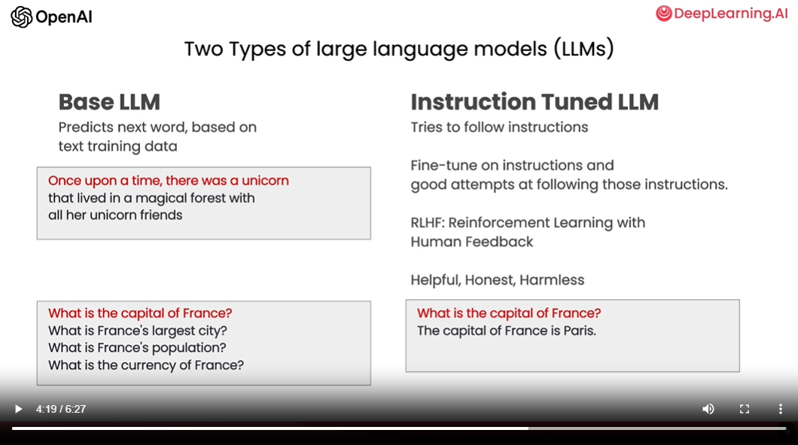

# notes

## the course
- Lectors:
    - Isa Fulford https://twitter.com/isafulf?lang=en
    - Andrew Ng https://twitter.com/AndrewYNg
    - 
- Andrew NG opinion: The power of LLMs for developers is using API calls to LLM to quickly build software applications
- Course goal:
    - sharing some of the possibilities of LLMs & best practices
- Course overview:
    - prompting best practices for software development
    - common use cases, summarizing, inferring, transforming, expanding
    - build a chatbot using an LLM
- Course focus:
    - focus on best practices for instruction tuned LLMs Which is what we recommend you use for most of your applications

## types of LLMs
- LLM = Large Language model
- There are x2 types of LLMs:
    - Base LLMs
    - Instruction Tuned LLMs
    - 
- Base LLM:
    - trained to predict the next word based on text training data
    - is often trained on large amount of data from the internet/other sources
- Instruction Tuned LLM:
    - trained to follow instructions
    - how ITLLMs are typically trained:
        - start off with a base LLMs that's been trained on a huge amount of text data
        - train it for the fine tune it with inputs and outputs that are instructions and good attempts to follow those instructions
        - refine using a technique called RLHF (Reinforcement Learning with Human Feedback) to make the system better able to be helpful and follow instructions
    - IT LLMs are trained trained to be helpful, honest and harmless :)
        - they're less likely to output problematic text such as toxic outputs compared to base LLMs
    - A lot of the practical usage scenarios have been shifting toward IT LLMs
- When you use an instruction tuned LLMs, think of giving instructions to another person, say someone that's smart but doesn't know the specifics of your task
    - When an LLMs doesn't work, sometimes it's because the instructions weren't clear enough
    - Picture yourself asking, say, a fresh college graduate to carry out this task for you
- Example: "write me something about Alan Turing"
    - it can be helpful to be clear about whether you want the text to focus on his scientific work OR his personal life OR his role in history OR something else
    - specify what you want the tone of the text to be, should it take on the tone like a professional journalist would write OR is it more of a casual note 
    - you can even specify what snippets of text LLM should read in advance to write this text
- Important principle of prompting LLMs: be clear and specific

# additional notes
- ChatGPT Retrieval Plugin: https://github.com/openai/chatgpt-retrieval-plugin
    - https://cdn.openai.com/chat-plugins/retrieval-gh-repo-readme/Retrieval-Final.mp4
- OpenAI cookbook: https://github.com/openai/openai-cookbook
- AI fund: a sister company to DeepLearning.AI https://www.aifund.ai/
- Understanding Large Language Models: https://medium.com/mlearning-ai/understanding-large-language-models-6664be71988e
- Fine-tuning LLMs: https://platform.openai.com/docs/guides/fine-tuning, https://cobusgreyling.medium.com/gpt-3-fine-tuning-beta-release-is-now-enabled-e00eeb532f07
