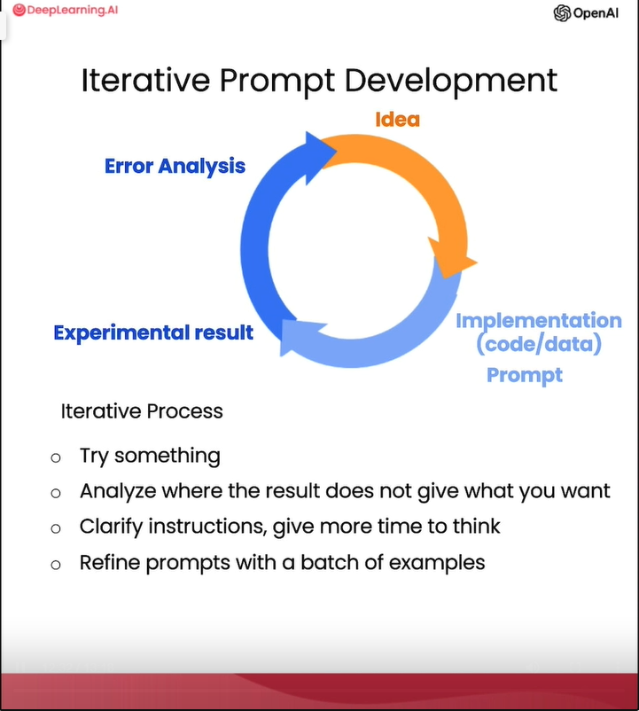

# source
https://learn.deeplearning.ai/chatgpt-prompt-eng/lesson/3/iterative

# notes

## about
- Lecture focus: showing some frameworks to think about how to iteratively develop a prompt
- Idea:
    - As long as you have a good process to iteratively make your prompt better, then you'll be able to come to something that works well for the task you want to achieve
    - What matters most is the process for getting to the prompts that work for your application.

## Iterative Prompt Development
- Stick to the following development flow when writing prompts to develop an application / xxx using an LLM:
    1. Write down an Idea you want to to do / the Task you want to complete
    2. Write a promt: clear, specific, and giving the system time to think
    3. Get the first results: an output from LLM
    3. Perform error analysis: figuring out why the instructions, were not clear enough or why it didn't give the algorithm enough time to think
    4. Refine the idea, refine the prompt
    5. Go to step 1: iterate over and over to get an effective solution
    - 
- "N perfect prompts" articles are not that useful: It's more important that you have a process for developing a good prompt for your specific application
- Conclusion:
    - Prompt Development is an iterative process
        1. try something
        2. analyze where the result does not give what you want
        3. clarify instructions, give the LLM more time to think to deliver the results you want
        4. refine prompt with a batch of examples
    - The key to being an effective prompt engineer isn't so much about knowing the perfect prompt, it's about having a good process to develop prompts that are effective for your application

## Modifying length of output
- Add more requirements to the prompt:
    - "use at most 50 words" - LLM might be not precise when giving them such precise requirements, they might output 52 words for example
    - "use at most 3 sentences"
    - "use at most 500 characters" - MIGHT NOT WORK because LLM work with tokens = words

# additional notes
- "top N chatgpt prompts" articles:
    - https://beebom.com/best-chatgpt-prompts/
    - https://mpost.io/100-best-chatgpt-prompts-to-unleash-ais-potential/
    - https://www.euronews.com/next/2023/03/24/getting-the-most-out-of-chatgpt-these-are-the-most-useful-prompts-to-try-now
- prompts ideas: https://github.com/yokoffing/ChatGPT-Prompts
- chatgpt prompts community: https://flowgpt.com/
