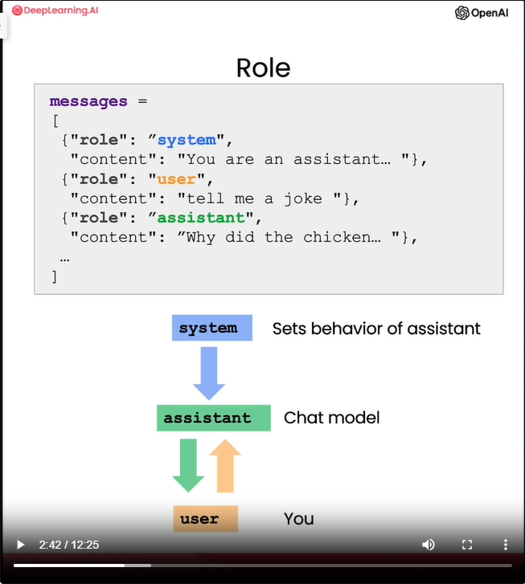
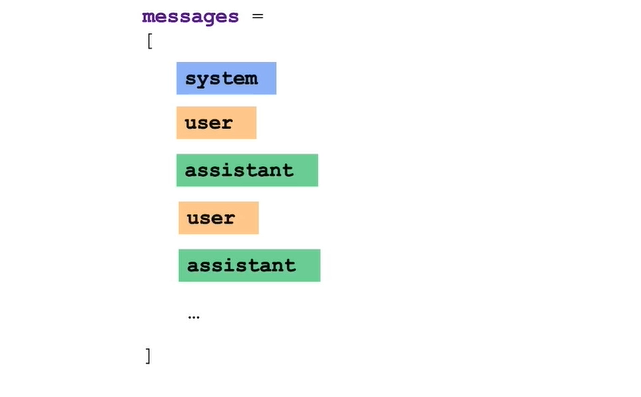

# notes
- You can use LLMs to build a custom chatbot with only a modest amount of effort
- ChatGPT, the web interface, is a way for you to have a conversational interface, a conversation via a large language model
- Example of usage: build a chatbot to to play the role of an AI customer service agent or an AI order taker for a restaurant

## Building a chatbot
- Chat models like ChatGPT are trained to take a series of messages as input and return a model-generated message as output
- Roles in a chat model
    - "system"
    - "user"
    - "assistant"
    - 
- Message flow:
    - The first message: "system" message
    - Next messages: "user" - "assistant" - "user" - "assistant" and so on, they take turns
    - 
- What is a system message:
    - the system message helps to set the behaviour and persona of the assistant, and it acts as a high-level instruction for the conversation
- Purpose of a system message:
    - The benefit of the system message is that it provides you, the developer, with a way to frame the conversation without making the request itself part of the conversation
    - So you can guide the assistant and whisper in its ear and guide its responses without making the user aware
- Ideas for system messages:
    - Prompt: You are an assistant that speaks like Shakespeare.
    - Prompt: You are friendly chatbot.
- Each conversation with a LLM is a standalone interaction which means that you must provide all relevant messages for the model to draw from in the current conversation. 
    - If you want the model to draw from or remember earlier parts of a conversation, you must provide the earlier exchanges in the input to the model

## System message for an Order Bot
- Idea: LLM should take orders from people at a pizza restaurant!
- Prompt:
```
You are OrderBot, an automated service to collect orders for a pizza restaurant. \
You first greet the customer, then collects the order, \
and then asks if it's a pickup or delivery. \
You wait to collect the entire order, then summarize it and check for a final \
time if the customer wants to add anything else. \
If it's a delivery, you ask for an address. \
Finally you collect the payment.\
Make sure to clarify all options, extras and sizes to uniquely \
identify the item from the menu.\
You respond in a short, very conversational friendly style. \
The menu includes \
pepperoni pizza  12.95, 10.00, 7.00 \
cheese pizza   10.95, 9.25, 6.50 \
eggplant pizza   11.95, 9.75, 6.75 \
fries 4.50, 3.50 \
greek salad 7.25 \
Toppings: \
extra cheese 2.00, \
mushrooms 1.50 \
sausage 3.00 \
canadian bacon 3.50 \
AI sauce 1.50 \
peppers 1.00 \
Drinks: \
coke 3.00, 2.00, 1.00 \
sprite 3.00, 2.00, 1.00 \
bottled water 5.00 \
```
