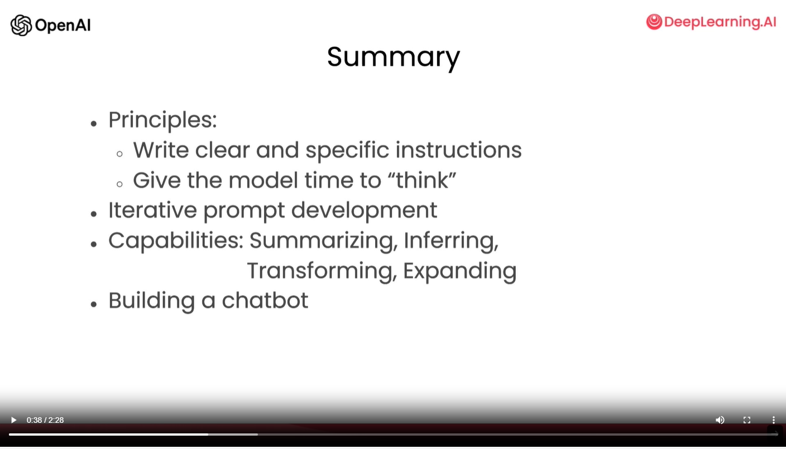

# source
https://learn.deeplearning.ai/chatgpt-prompt-eng/lesson/9/conclusion

# notes
- Things that were covered in the course:
    - x2 key principles for prompting:
        1. Write clear and specific instructions
        2. Give the model time to "think"
    - iterative prompt development: having a process to get to the prompt that's right for your application is key
    - capabilities of LLMs that are useful for many applications, specifically summarizing, inferring, transforming, and expanding
    - building a custom bot
    - 
- Use LLMs responsibly & only build things that will have a positive impact
    - people that build AI systems can have a huge impact on others. So it's more important than ever that all of us only use these tools responsibly

# additional notes
- How ChatGPT Can Positively Affect Your Job: https://www.upwork.com/resources/how-chat-gpt-can-positively-affect-your-job
- The Implications of ChatGPT for Legal Services and Society: https://clp.law.harvard.edu/knowledge-hub/magazine/issues/generative-ai-in-the-legal-profession/the-implications-of-chatgpt-for-legal-services-and-society/
- ChatGPT - legal challenges, legal opportunities: https://www.fieldfisher.com/en/insights/chatgpt-legal-challenges-legal-opportunities
- ChatGPT - a new era of fraud: https://www.fraud0.com/resources/chatgpt-ad-fraud/ 
- Scam ChatGPT applications: https://www.macrumors.com/2023/04/25/chatgpt-scam-apps-mac-app-store/
- ChatGPT scam attacks: https://unit42.paloaltonetworks.com/chatgpt-scam-attacks-increasing/ 
- The dark side of ChatGPT: https://www.digitaltrends.com/computing/bad-things-chatgpt-has-been-used-for/
- ChatGPT and copyright of AI-generated content: https://theconversation.com/chatgpt-what-the-law-says-about-who-owns-the-copyright-of-ai-generated-content-200597
